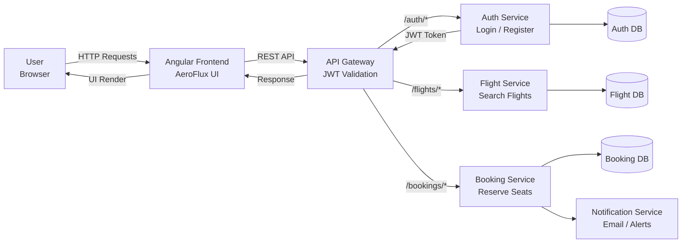

# AeroFlux – Flight Booking Frontend
A modern, responsive Flight Booking Frontend Application built using Angular, designed to work with a microservices-based backend.
AeroFlux allows users to search flights, authenticate securely, and interact with a clean, professional UI inspired by real-world travel platforms.

### Project Structure
```
src/
│
├── app/
│   ├── core/
│   │   └── services/
│   │       └── auth.service.ts
│   │
│   ├── pages/
│   │   ├── search/
│   │   │   ├── search.html
│   │   │   ├── search.css
│   │   │   └── search.ts
│   │   │
│   │   ├── login/
│   │   │   ├── login.html
│   │   │   ├── login.css
│   │   │   └── login.ts
│   │   │
│   │   └── register/
│   │       ├── register.html
│   │       ├── register.css
│   │       └── register.ts
│
├── assets/
│   └── hero-place.png
│
└── main.ts
```

### Overall flow:-


### Tech Stack


### AeroFlux provides :

- Seamless flight search experience.

- Secure authentication (Login & Register).

- Modern UI with consistent theme.

- Fully responsive design for all devices.


### Screenshots of the project with validations 
```
Home page :-
```


```
Flight Search with source, destination and date :-
```


```
Resgister page :-
```


```
User registers successfully :
```


```
Login Successful :
```


### Validations :-
```
Source and Destination can not be the same validation :-
```


```
Incomplete details validation
```


```
Can not search flights for past dates validation :-
```


### All critical validations are implemented on the frontend:

Search Form

- Source is required

- Destination is required

- Source and Destination cannot be the same

- Date is required

- Past dates are not allowed

Login Form

- Email is required

- Valid email format enforced

- Password is required

Register Form

- Name is required

- Email is required and validated

- Password is required

- Submit disabled if form is invalid

Validation messages are shown immediately to guide users.

### How to run locally 

Prerequisites

- Node.js (v18+ recommended)

- Angular CLI

Steps 

```
git clone https://github.com/saksham-0425/CHUBB_flight-booking-frontend
cd CHUBB_flight-booking-frontend
npm install
ng serve
```
Open : 
```
http://localhost:4200
```

### Backend Integration

The frontend connects to backend services via:

- API Gateway

- JWT-secured endpoints

- Microservices architecture

Example:
```
GET /flights/search?source=DEL&destination=BOM&date=2025-01-10
```

### Author
Saksham Omar

- Final Year B.Tech CSE


