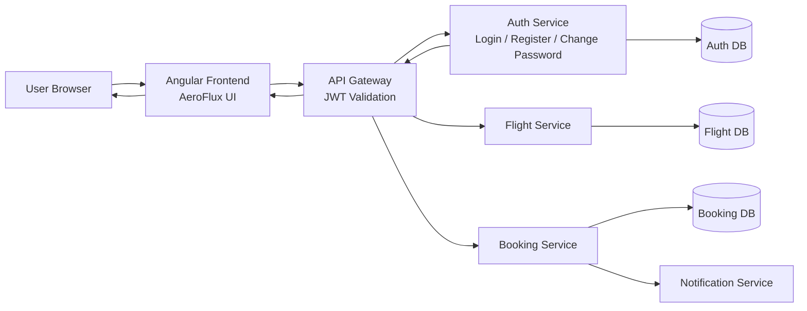

# AeroFlux – Flight Booking Frontend
(Docker and local application.properties have also been created, (screenshots attached below for the project and folder structure.))

A modern, responsive Flight Booking Frontend Application built using Angular, designed to work seamlessly with a secure microservices-based backend.

AeroFlux allows users to search flights, authenticate securely, manage their accounts, and interact with a clean, professional UI inspired by real-world travel platforms.

### Requirements Fulfilled (Explicit Confirmation)

All the following requirements have been fully implemented and verified in the project:
```
| Requirement                         | Status        | Enforcement           |
| ----------------------------------- | -----------   | --------------------- |
| Add Flights (Admin)                 |     Completed | Backend + UI          |
| RBAC (Only Admin can add flights)   |     Completed | API Gateway + Backend |
| Two Properties Files                |     Completed | Config Server         |
| Optimised Dockerfile                |     Completed | Multi-stage build     |
| Change Password                     |     Completed | Backend + UI          |
| UI Validations                      |     Completed | Angular               |
| In-app Messages / Popups            |     Completed | Angular               |
| Backend / Postman Bypass Prevention |     Enforced  | Gateway + Security    |
```
Security Guarantee : 
```
All rules (authentication, authorization, RBAC) are enforced at the API Gateway and backend service level.
They cannot be bypassed via Postman, curl, or direct backend calls.
```

### Project Structure
```
src/
│
├── app/
│   ├── core/
│   │   ├── services/
│   │   │   └── auth.service.ts
│   │   ├── guards/
│   │   │   └── auth-guard.ts
│   │   └── interceptors/
│   │       └── auth.interceptor.ts
│   │
│   ├── features/
│   │   ├── flight/
│   │   │   └── search/
│   │   ├── auth/
│   │   │   ├── login/
│   │   │   ├── register/
│   │   │   └── change-password/
│   │   └── booking/
│   │
│   └── app.routes.ts
│
├── assets/
│   └── hero-place.png
│
└── main.ts
```

### Overall flow:-


### Tech Stack


### Authentication & Authorization (RBAC)
Authentication
- JWT-based authentication
- Token attached automatically using HTTP interceptor
- Protected routes guarded using authGuard
Role-Based Access Control
```
| Role       | Permissions                                   |
| ---------- | --------------------------------------------- |
| ROLE_USER  | Search flights, book tickets, change password |
| ROLE_ADMIN | Add flights, manage flight inventory          |
```
Even if an admin or user tries to violate rules via Postman, the backend rejects the request.


AdminUI :-

User tries to add a flight, backend logic blocks it :-


### Change Password Feature :-

- Dedicated Change Password UI

- Old password verification

- New password validation

- Confirm password matching

- Secure backend API (PUT /auth/change-password)

- JWT-authenticated & role-protected

- Success and error messages shown in-app

Form to change the password, based on the old password :-


Password change option visible to only logged in users :-


### Features Implemented So Far
User Features

- Flight search (source, destination, date)

- Secure login & registration

- Change password

- Booking flights
- Cancel Flights (not within 24 hours of the scheduled flight).

- Logout

- Responsive UI

Booking being confirmed :-


Track booking through PNR :-


Admin Features

- Responsive UI

- Add flights

- RBAC-protected admin routes

- Backend enforcement (cannot be bypassed)
  
Admin can access, edit and delete all the flights :-
  

Validations have been applied for adding a flight (admin only) :-


### Screenshots of the project with validations 
```
Home page :-
```


```
Flight Search with source, destination and date :-
```


```

Login Successful :
```


### Validations :-
```
Source and Destination can not be the same validation :-
```

```
Incomplete details validation
```

```
Can not search flights for past dates validation :-
```


### All critical validations are implemented on the frontend:

Search Form

- Source is required

- Destination is required

- Source and Destination cannot be the same

- Date is required

- Past dates are not allowed

Login Form

- Email is required

- Valid email format enforced

- Password is required

Register Form

- Name is required

- Email is required and validated

- Password is required

- Submit disabled if form is invalid

Validation messages are shown immediately to guide users.

### How to run locally 

Prerequisites

- Node.js (v18+ recommended)

- Angular CLI

Steps 

```
git clone https://github.com/saksham-0425/CHUBB_flight-booking-frontend
cd CHUBB_flight-booking-frontend
npm install
ng serve
```
Open : 
```
http://localhost:4200
```

### Backend Integration

The frontend connects to backend services via:

- API Gateway

- JWT-secured endpoints

- Microservices architecture

Example:
```
GET /flights/search?source=DEL&destination=BOM&date=2025-01-10
```

### Author
Saksham Omar

- Final Year B.Tech CSE


